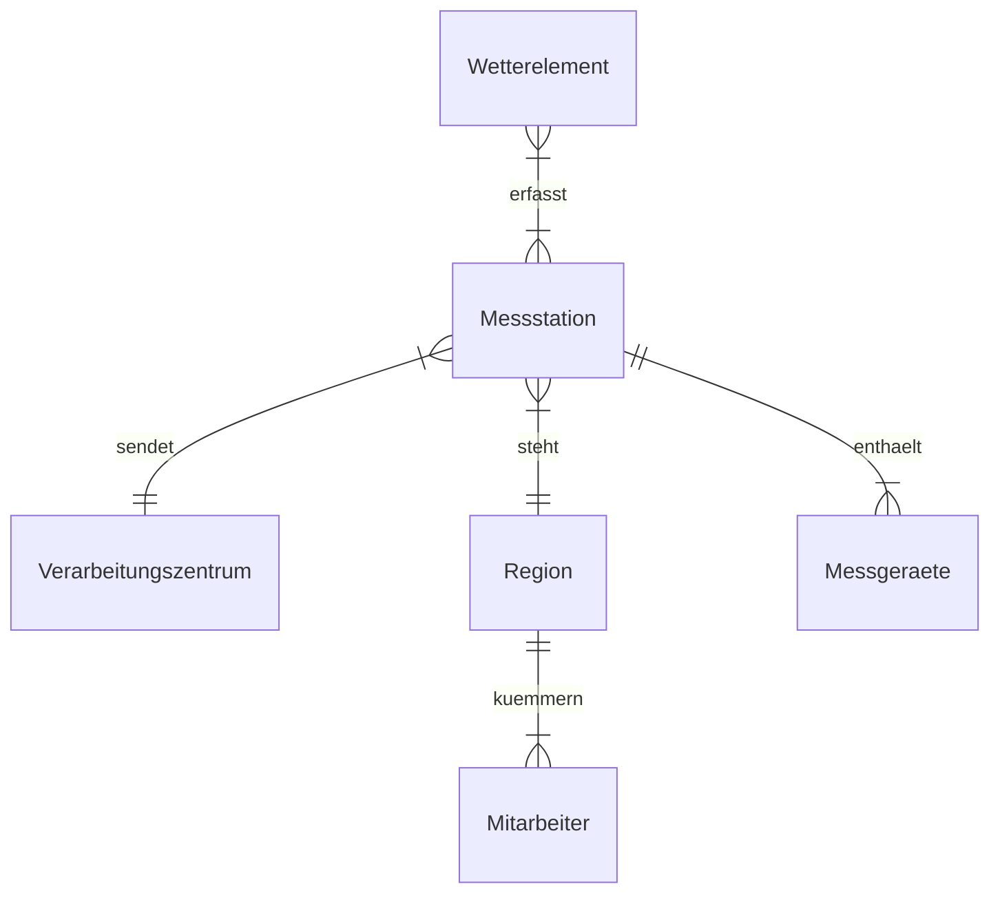

---
tags:
  - "#Berufsschule"
  - "#Lernfeld10_11_12"
---
## Aufgabe 1
![[ERM_Bugs.png]]

## Aufgabe 5
![[ERM_Aufgabe5.png]]

---
## Aufgabe 1
![[Pasted image 20241004082402.png]]

## Aufgabe 2

## Aufgabe 3
+ **Datenredundanz**: Mehrfach vorhanden sein der selben Information in einer Datenbank
+ **Normalisierung**: Prozess zur Herstellung der Datenintegrität in einer Datenbank.
+ **Primärschlüssel**: Hauptschlüssel; Identifikator, an dem ein Objekt eindeutig erkannt werden kann.